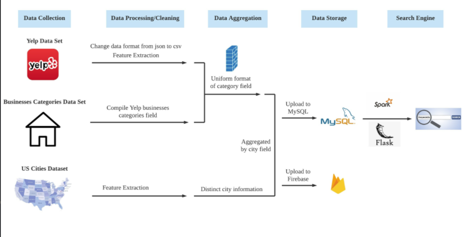
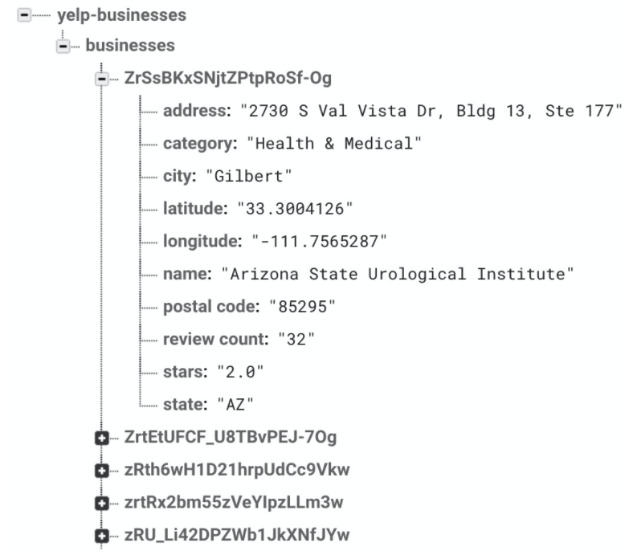
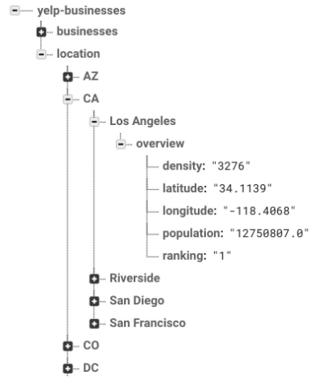
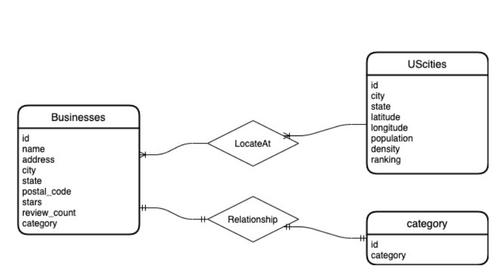

# The United States City Businesses & Services Keywords Search Engine System
```
Members: Stefan Lin, Yunhong Wang, Yuchao Zhang
```
## Project Motivation
We want to design a system that provides a reference for folks who are trying to seek a new city to relocate in. We wish the system provides an overview of all their interested businesses' information so that they can compare between one city and another. We vision this search engine plays the role as an information provider when a folk is considering relocation.

## Data Problems

- Data cleaning: Clean out unused columns; Clear out Canadian businesses; Simplify business categories
- Data Storing: Use Firebase as a data storage anchor where we process the data, and eventually use MySQL as the API where our UI fetch datasets from.
- Data Integration: Use city name and belonging state id to integrate the Yelp Business Data and U.S. Cities Data
- Data Presentation: Use spark to do data sorting and present the top 20 business lists

## Project Data Architecture Diagram


## Description Datasets, Data Cleaning, Data Storing, and Data Integration

### [Yelp Business Data](https://www.yelp.com/dataset/download)
#### Description
This Yelp business dataset comes as a json file includes micro data of biasedly reported Yelp registered businesses. This dataset contains the businesses’:

1. Identification string, which is assigned by Yelp; 
2. Name; 
3. Locational information including street address, city, state, postal code, latitude and longitude; 
4. Average stars rated by Yelp users; 
5. Total number of reviews; 
6. A boolean variable which shows if the business is currently open or not; 
7. Business attributes that shows the businesses features like parking; 
8. All belonging categories in the format of a leading category and its descending categories (e.g. “Health & Medical, Fitness & Instruction, Yoga, Active Life, Pilates”);
9. Hours open

#### Data Cleaning
We first wrote a python script to transform the json file to a csv file so it is easier to process on our local file system when we are doing data cleaning. Secondly, we filtered out Canadian businesses by taking advantage of the zip code since Canada has a different zip-code system from the United States; and we filtered out closed-for-good businesses (is_open == 0). We then simplified the categorization using the categories.json file as a supporting dataset and output a new dataset with selected needed data attributes and simplified categorizes (named as final_cat) in a csv file. 

Then we store the dataset on Firebase as show below:



### [U.S. Cities Demographic & Geographic Data](https://simplemaps.com/static/data/us-cities/1.72/basic/simplemaps_uscities_basicv1.72.zip)

#### Description
The U.S. Cities dataset comes as a csv file with the following attributes:
1. City name
2. City ASCII (American Standard Code for Information Interchange)
3. State ID
4. State Name
5. County FIPS code
6. County Name
7. latitude and longitude
8. Population Size
9. Population Density
10. A boolean variable to show if the city contains military bases
11. A boolean variable to show if the city is held incorporated
12. Timezone
13. City ranking
14. City zip codes
15. City ID

#### Data Cleaning
We wrote a python script with the pyrebase package to select the needed attributes and planned to use this piece of code to do Firebase storage of our city data. Thus, we also put a location as a general key, with state ID (abbreviation) as descendent keys. Under each state, there are its belonging cities with a key named overview. Under overview, we have  the information including population size and density, latitude and longitude, and its ranking. Then we processed it to Firebase and the format of storage is presented below:



## Data Integration, Finalizing Storing and Transferring to MySQL

We visualize the entity relationship model as follows:



According to the ER model, we use city name and state ID/ abbreviation as our tool to do data integration. We also put this step into our UI design. We wrote a [SQL query script](business.sql) to anchor the integration of business data and the city data by creating table structures for both and store them in MySQL local database and prepare for the use of data in the user interface.

## User Interface Design and Interaction between UI and Database
For the web search engine, we used mysql as our data storage system to create our search engine. We used the tornado package and flask app to run our web, and we referred to some previous students’ web models to design our own. For the city relation and business relation, we used a left outer join which can be searched by the city name and state (the results will show the information of the city even if it does not have any business, it will show none at the business column). The code for UI design is in the [keywordsearch directory](keywordsearch).

## Feature Functions of Our Search Engine System:
1. By searching a city, a top 20 local business list will be presented
2. Can search by business names and return detailed information
3. Can do fuzzy searching like if you search "ice cream", the system will return a top 20 list of businesses with the keyword ice cream.
   
With these features, the system provides a reference for folks who are trying to seek a new city to relocate/ go to school/ get a job in. This provides an overview of all their interested businesses' information so that they can compare between one city and another. This search engine plays the role as an information provider.

